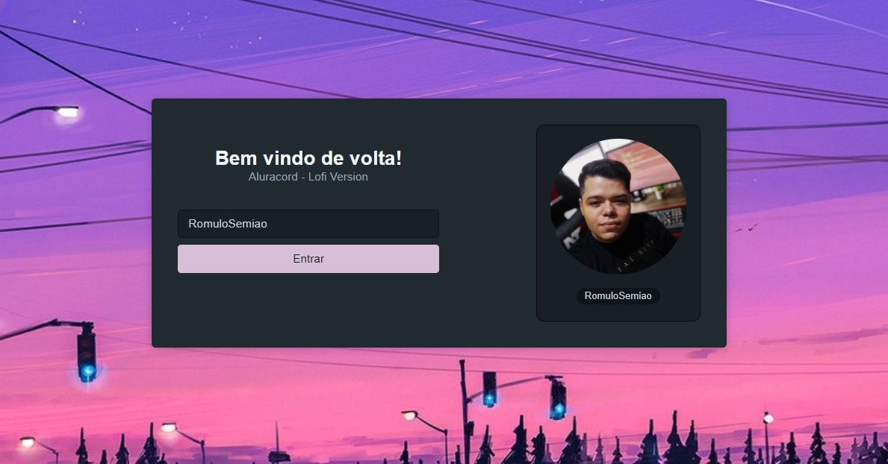

# Aluracord_Lofi
Projeto clone do discord, desenvolvido em NextJs, feito na imersão react da Alura.

Imersão totalmente proveitosa. Foi o meu primeiro contato com um projeto em ReactJs/NextJs, envolvendo Hooks e conceitos básicos de lógica.

## Login
O login foi feito utilizando o JSON do github.

## O CHAT
O chat funciona em tempo real. Então se dois usuários estiverem logados, eles conseguirão comunicar-se entre si.
