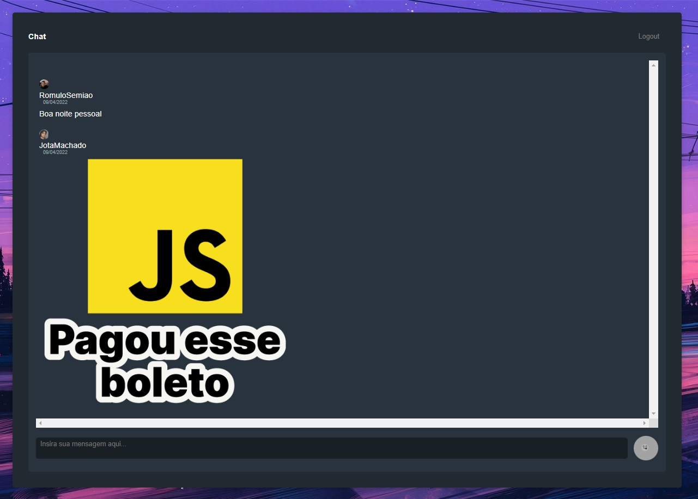

# Aluracord_NextJS
Projeto clone do discord, desenvolvido em NextJs no Frontend e SupaBase para Backend, feito na imersão react da Alura.

Imersão totalmente proveitosa. Foi o meu primeiro contato com um projeto em NextJs/ReactJS, envolvendo Hooks e conceitos básicos de lógica.

## Login

O login foi feito utilizando o JSON do GitHub. 
Para efetuá-lo, deve apenas digitar o Username. 

## O CHAT

O chat funciona em tempo real, então se dois usuários estiverem logado eles conseguirão comunicar entre si. 
Os seus dados são hospedados na plataforma Supabase, utilizando Postgres e o Servidor AWS. 

